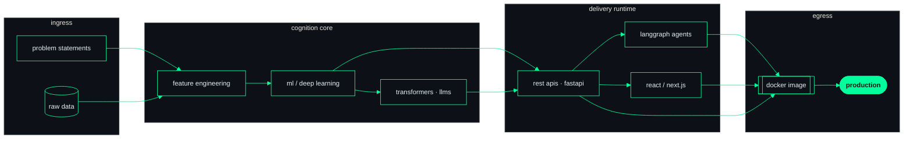
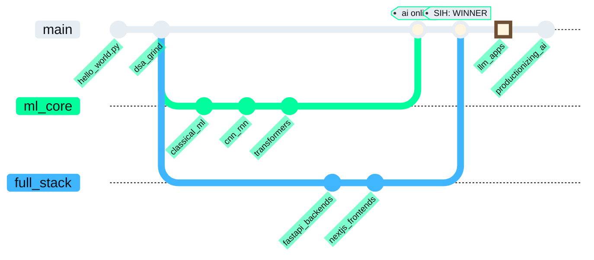

<!-- ────────────────────────────────────────────────────────────────────────
     This README renders as a live terminal session.
     Every section is a shell command — GitHub renders its stdout.
     Palette: #0D1117 (ground) · #00FF9C (phosphor) · #8B949E (dim)
──────────────────────────────────────────────────────────────────────── -->

<p align="center">
  
</p>

```text
Last login: always, from everywhere

██████╗ ██╗  ██╗██████╗ ██╗   ██╗██╗   ██╗    ██╗  ██╗██╗   ██╗███╗   ███╗ █████╗ ██████╗
██╔══██╗██║  ██║██╔══██╗██║   ██║██║   ██║    ██║ ██╔╝██║   ██║████╗ ████║██╔══██╗██╔══██╗
██║  ██║███████║██████╔╝██║   ██║██║   ██║    █████╔╝ ██║   ██║██╔████╔██║███████║██████╔╝
██║  ██║██╔══██║██╔══██╗██║   ██║╚██╗ ██╔╝    ██╔═██╗ ██║   ██║██║╚██╔╝██║██╔══██║██╔══██╗
██████╔╝██║  ██║██║  ██║╚██████╔╝ ╚████╔╝     ██║  ██╗╚██████╔╝██║ ╚═╝ ██║██║  ██║██║  ██║
╚═════╝ ╚═╝  ╚═╝╚═╝  ╚═╝ ╚═════╝   ╚═══╝      ╚═╝  ╚═╝ ╚═════╝ ╚═╝     ╚═╝╚═╝  ╚═╝╚═╝  ╚═╝

dhruv@workstation
──────────────────────────────────────────────────
OS          NsutOS (rolling release, deadline-driven)
Host        Netaji Subhas University of Technology
Kernel      B.Tech CSE — 3rd Year
Shell       /bin/research-build-deploy
Resolution  research × production
Uptime      since first torch.backward()
Locale      new-delhi, IN
GPU         dreams@cuda:0
Memory      transformers loaded · context window: unlimited
```

```console
dhruv@workstation:~$ whoami
Dhruv Kumar — engineer of transformer-based AI systems.
I train things that learn, ship things that scale,
and occasionally win national hackathons.
```

```console
dhruv@workstation:~$ lsmod | sort -k2 -r
Module              Size        Used by
python              ██████████  everything_below
pytorch             █████████   transformers, cnn_rnn, fine_tuning
transformers        █████████   nlp, llm_apps, huggingface
langchain           ████████    rag_pipelines
langgraph           ████████    agentic_workflows, multi_agent
fastapi             ████████    rest_apis, inference_servers
nextjs              ████████    frontends, ssr_apps
react               ███████     uis, hackathon_uis
faiss               ███████     vector_search, semantic_retrieval
tensorflow          ███████     deep_learning, model_training
scikit_learn        ███████     feature_engineering, classic_ml
postgresql          ██████      supabase, persistence
docker              ██████      containerized_deploys
tailwind            █████       ui_polish
javascript          █████       the_glue

# compiled into kernel at boot:
# numpy · pandas · matplotlib · seaborn · jupyter · git · github
```

```console
dhruv@workstation:~$ dhruv render --graph=architecture
rendering pipeline... done. output attached below.
```



```console
dhruv@workstation:~$ git log --graph --all --oneline
rendering commit topology... done. output attached below.
```



```console
dhruv@workstation:~$ grep -iE "winner|shipped|active" /var/log/achievements.log
[ACH-001]  Smart India Hackathon      ▸ WINNER — national level
[ACH-002]  Amazon ML Summer School    ▸ TOP 2% — 10,000+ participants
[ACH-003]  hackathon circuit          ▸ ACTIVE — scalable AI products
```

```console
dhruv@workstation:~$ htop --user=kumardhruv88 --mode=github
```

<p align="center">
  
</p>

<p align="center">
  
</p>

```console
dhruv@workstation:~$ cat /proc/dhruv/focus
llm_apps         [ACTIVE]   building llm-powered applications
agentic_ai       [ACTIVE]   multi-agent workflows over langgraph
rag_pipelines    [ACTIVE]   retrieval-augmented generation at scale
productionize    [ALWAYS]   models that survive contact with real users
```

```console
dhruv@workstation:~$ curl -s https://api.dhruvkumar.dev/v1/contact | jq
```

```json
{
  "status": 200,
  "channels": {
    "linkedin": "https://www.linkedin.com/in/dhruv-kumar-64752327a",
    "email": "kumardhruv2308@gmail.com",
    "portfolio": "https://portfolio-blush-sigma-cnmnqaewtr.vercel.app"
  },
  "open_to": ["ai/ml engineering", "research collaborations", "hackathon teams"],
  "latency": "low"
}
```

<p align="center">
  <a href="https://www.linkedin.com/in/dhruv-kumar-64752327a/"></a>
  <a href="mailto:kumardhruv2308@gmail.com"></a>
  <a href="https://portfolio-blush-sigma-cnmnqaewtr.vercel.app/"></a>
</p>

```console
dhruv@workstation:~$ exit
logout
Connection to dhruvkumar.dev closed.
```

<p align="center">
  
</p>

<p align="center">
  <sub>star what deserves stars · fork what sparks ideas</sub><br />
  <sub>no emojis were harmed in the making of this profile</sub>
</p>
